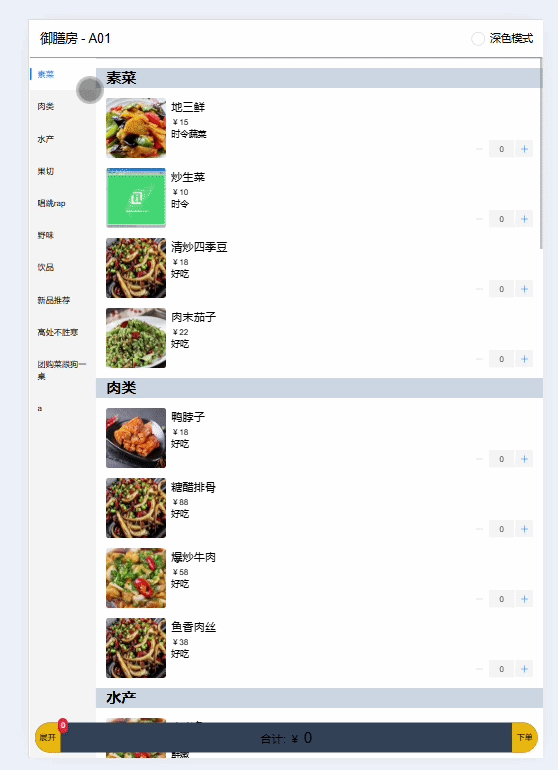
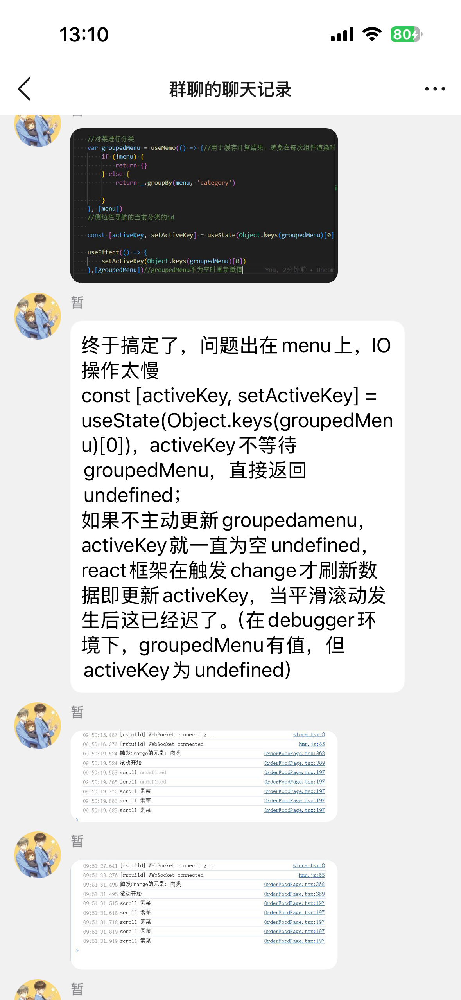
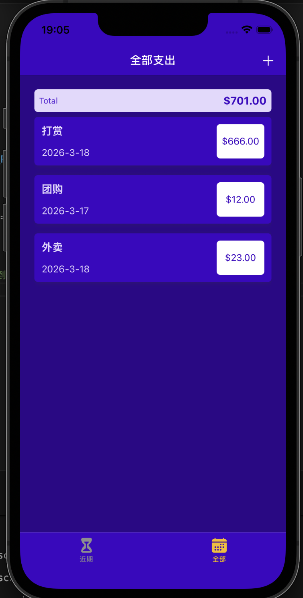
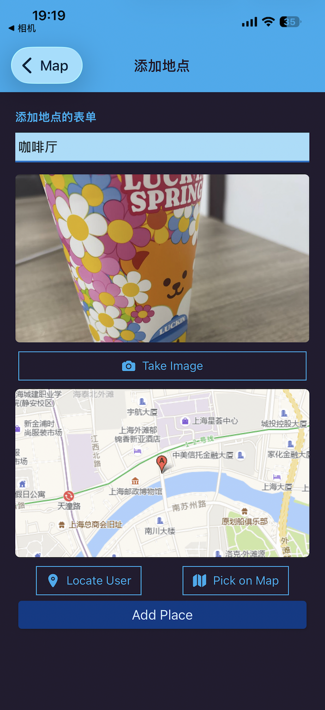
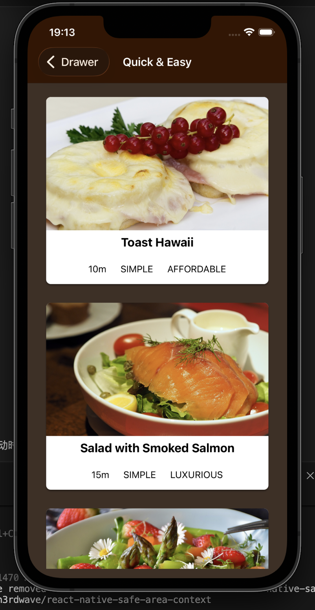

# 求职项目展示

- 本项目为求职用途，用于技术能力展示

### 项目二
- Scan-to-Order 为 Web 端实战项目

  

  
  

### 项目三
- Bill、RN-Map、restaurant 目录均为 React Native 实战项目

  
  
  

---

## 主要优化与修改

- Web 端使用 tailwindCSS + React + ahooks + ant design mobile 开发
  - 解决了 SideBar 组件第一次切换选项时按键闪烁的问题。原因：useState 依赖异步数据时初始值同步返回 undefined，导致按钮状态跳回初始选项；
  - 该方案可优化“侧边导航不跟随滚动、无动画”的体验，流畅度媲美肯德基 App；
  - 利用 Socket.IO 实现全端实时库存更新，性能优于轮询；
  - 相关贡献获得 8 年前端专家认可 👍

- React Native 项目
  - 将代码从 JavaScript 重构为 TypeScript，提升类型安全与可维护性
  - 适配中文生产环境，优化项目实用性

---

## 来源声明

- React Native 项目基于 Academind 开源教程代码二次开发与优化：
  - 原仓库：https://github.com/academind/react-native-practical-guide-code.git
  - 原作者：Academind (maxschwarzmueller)

- Web 端项目基于 xieranmaya 的前端项目开发

